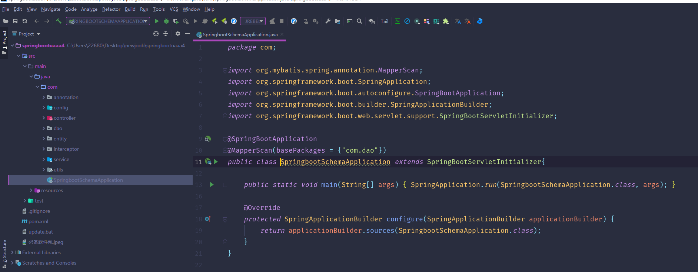
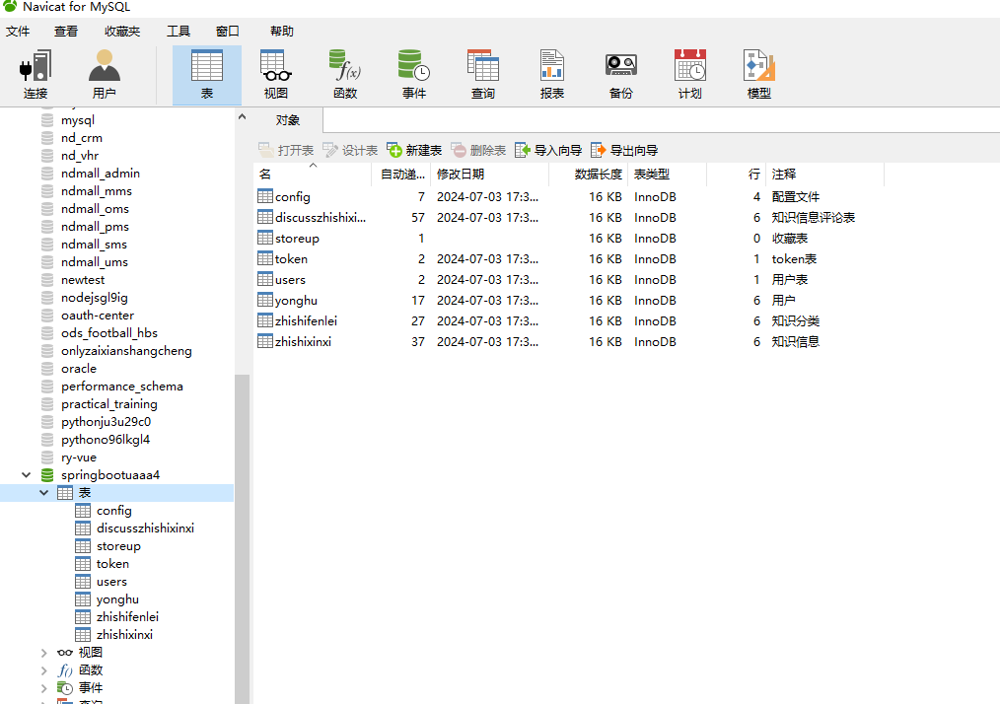
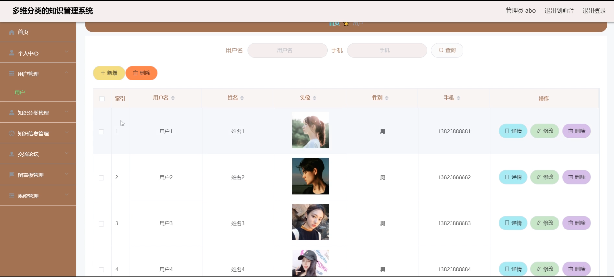
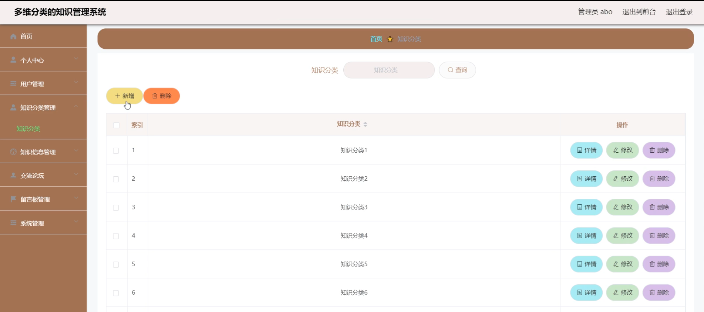
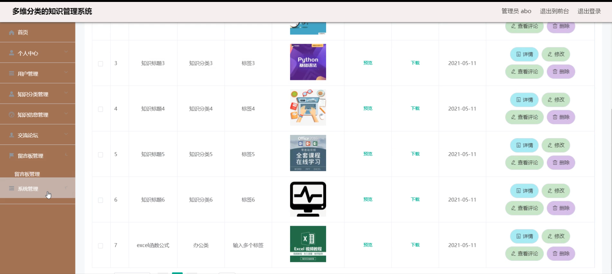
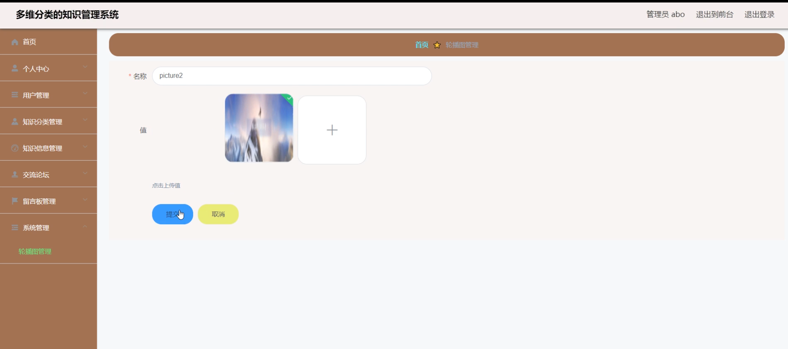
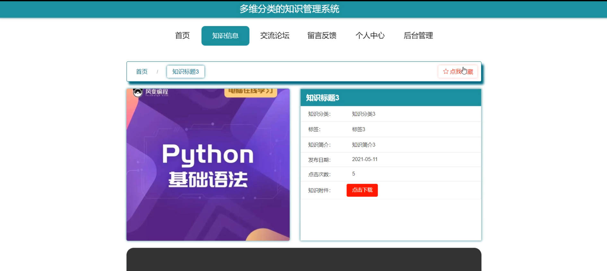
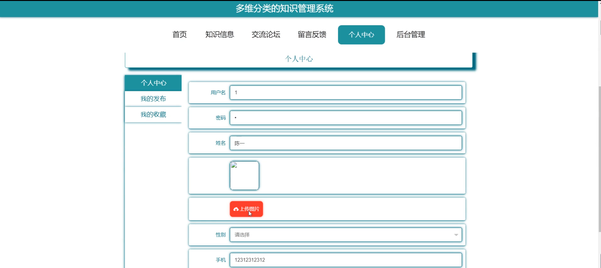
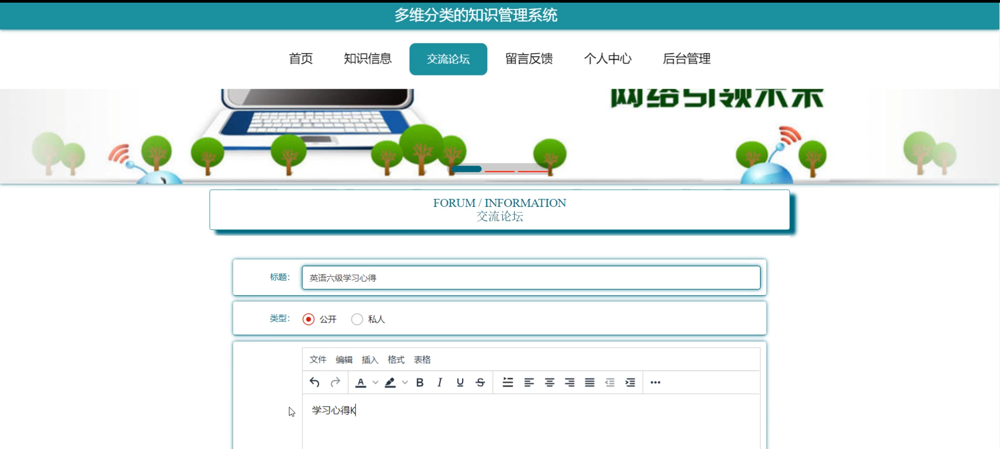
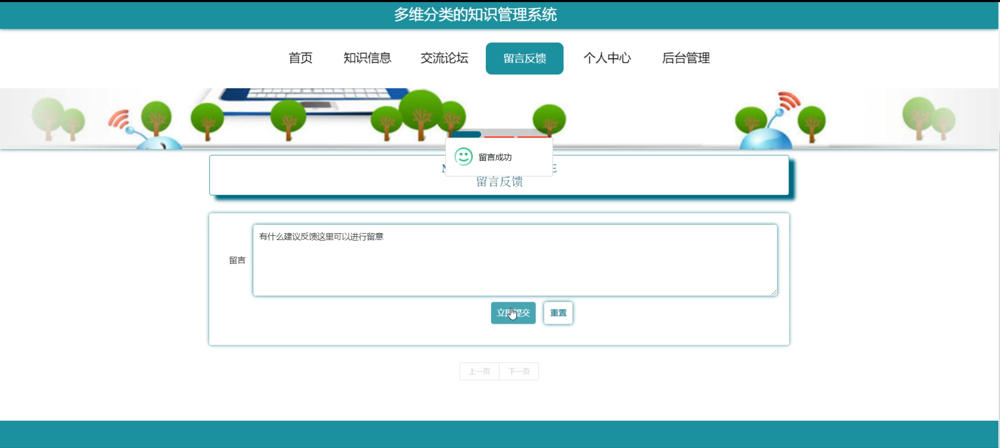

# 基于多维分类的知识管理系统

---
### 👉作者QQ ：1556708905 微信：zheng0123Long (支持定制修改、部署调试、定制毕设)

### 👉接网站建设、小程序、H5、APP、各种系统等

---

#### 介绍

在信息爆炸的时代，知识的有效管理和利用变得至关重要。基于多维分类的知识管理系统应运而生，旨在为用户提供一个高效、便捷、有序的知识管理和交流平台，帮助用户更好地获取、整理、分享和应用知识。

#### 技术栈

后端技术栈：Springboot+Mysql+Maven

前端技术栈：Vue+Html+Css+Javascript+ElementUI

开发工具：Idea+Vscode+Navicate

#### 系统功能介绍

（一）管理员角色  
个人中心：管理员可以在此查看和修改个人信息，设置工作偏好和通知方式。  
用户管理：全面负责用户的注册、登录、权限设置等。可以审核新用户的注册申请，对用户进行分组管理，根据用户的行为和需求调整其权限，还能对违规用户进行封禁或限制操作。  
知识分类管理：创建和维护知识的分类体系。根据不同的主题、领域、难度级别等维度对知识进行分类，确保知识能够被准确地归类和检索。管理员可以随时添加、修改或删除知识分类，以适应知识体系的变化和发展。  
知识信息管理：对系统中的知识内容进行审核、编辑和发布。确保知识的准确性、完整性和时效性，对优质的知识进行推荐和展示，对不符合要求或过时的知识进行修改或删除。  
交流论坛：监督论坛的交流情况，处理违规言论和不良信息。可以设置论坛的主题和规则，引导用户进行有价值的讨论和交流。  
留言板管理：查看和回复用户在留言板上的留言，及时解决用户的问题和反馈。管理员可以对留言进行分类和标记，以便更好地跟踪和处理用户的需求。  
系统管理：负责整个系统的配置、维护和升级。包括服务器的管理、数据库的优化、安全设置等，确保系统的稳定运行和数据的安全。  

（二）用户角色  
首页：展示热门知识、最新知识、推荐分类等，为用户提供快速导航和概览。  
知识信息：用户可以按照多维分类体系浏览和搜索所需的知识，查看知识的详细内容、相关评论和引用。  
交流论坛：用户能够在论坛中与其他用户就特定的知识主题展开讨论，分享经验和见解，提问和解答问题。  
留言反馈：用户可以通过留言板向管理员或其他用户提出问题、建议或反馈，与系统进行互动。  
个人中心：用户可以在此修改个人资料、查看自己的浏览历史、收藏的知识、发布的评论和提问等。  
后台管理：用户可以对自己发布的知识内容、留言和评论进行管理，还可以设置自己的知识获取偏好和通知方式。  

#### 系统作用

提高知识利用效率  
通过多维分类，用户能够快速准确地找到所需的知识，节省了搜索和筛选的时间，提高了知识的获取效率。  
促进知识共享与交流  
交流论坛和留言反馈功能为用户提供了交流和分享的平台，促进了知识的传播和创新，营造了良好的学习氛围。  
提升知识质量  
管理员对知识的审核和管理，保证了系统内知识的准确性、可靠性和权威性，提升了知识的质量和价值。  
个性化学习体验  
个人中心和后台管理功能允许用户根据自己的兴趣和需求定制知识获取方式，实现个性化的学习和发展。  
增强组织竞争力  
对于企业或团队等组织，该系统有助于积累和传承内部知识，提高员工的业务水平和创新能力，增强组织的核心竞争力。  

#### 系统功能截图

代码结构

数据库表

登录

用户管理

知识分类管理

知识信息管理

系统管理

前台页面首页

知识信息

个人中心

交流论坛

留言反馈

#### 总结

基于多维分类的知识管理系统通过丰富的功能和清晰的角色分工，为知识的管理和传播提供了有力的支持。无论是管理员还是用户，都能在这个系统中发挥作用，实现知识的价值最大化。未来，随着技术的不断进步和用户需求的变化，该系统将不断完善和优化，为知识管理领域带来更多的创新和发展。

#### 使用说明

创建数据库，执行数据库脚本 修改jdbc数据库连接参数 下载安装maven依赖jar 启动idea中的springboot项目

后台地址：http://localhost:8080/springbootuaaa4/admin/dist/index.html

管理员  abo 密码 abo

前台地址：http://localhost:8080/springbootuaaa4/front/index.html